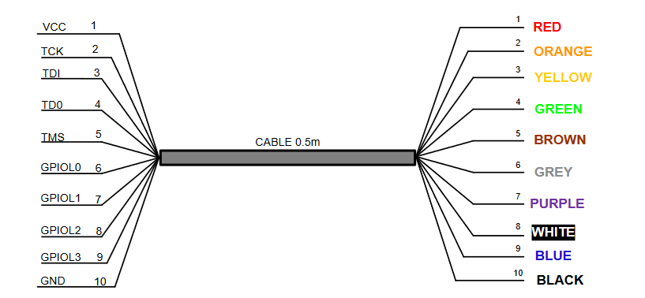

# C232HM-DDHSL-0

## Documentation:
[pdf](https://ftdichip.com/wp-content/uploads/2023/07/DS_C232HM_MPSSE_CABLE-.pdf)
## Installation
The following packages are required:
```bash
conda install --channel=conda-forge pyftdi
pip install pyftdiwin
conda install --channel=conda-forge ftd2xx
```
For the installation install the following drivers [https://ftdichip.com/drivers/d2xx-drivers/](https://ftdichip.com/drivers/d2xx-drivers/)
## Instruction

The USB to MPSSE Serial cable 3.3V -0.5m can be connected according to the following way:



<!-- Make sure you have the correct drivers installed: -->
