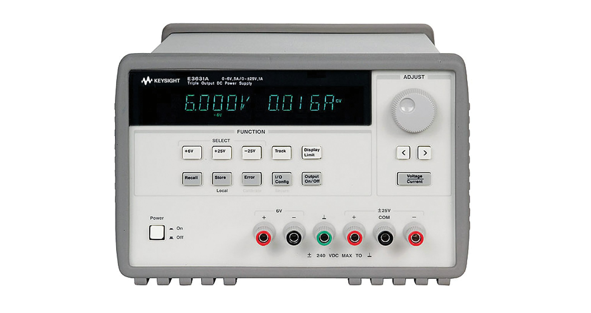

# E3631A
The E3631A is a 80W Triple Output Power Supply, 6V, 5A & ±25V, 1A

A user guide to the E3631A can be found in [here](./User_Guide.pdf)

The file [E3631A.py](./E3631A.py) contains the class E3631A.

The E3631A must be connected to a GPIB port. May the constructor of the class E3631A must be eddited!

## Methodes
The following mehtodes are implemented in the class E3631A:
* set_6V(voltage:float, ILimit:float=5.0):
    * The set_6V methode sets the voltage level (0-6V) of the 6V output. The current can also be limmited by the optional parameter ILimit (0-5A)
* set_P25V(voltage:float, ILimit:float=1.0):
    * The set_P25V methode sets the voltage level (0V - 25V) of the Postive 25V output. The current can also be limmited by the optional parameter ILimit (0-1A)
* set_N25V(voltage:float, ILimit:float=1.0):
    * The set_N25V methode sets the voltage level (-25V - 0V) of the Negative 25V output. The current can also be limmited by the optional parameter ILimit (0-1A)
* en_output(en=True):
    * Enables or disables all outputs
* meas_6V()
    * Returns the output voltage and current of the 6V output
* meas_P25V()
    * Returns the output voltage and current of the Positive 25V output
* meas_N25V()
    * Returns the output voltage and current of the Negative 25V output
* display_select(select="6V"):
    * Set the display of the E3631A to the selected ouput. Possible Values are:
        * "6V"
        * "P25V"
        * "N25V"