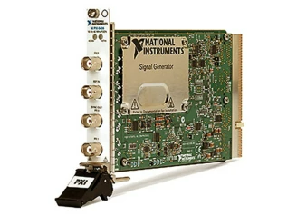

# PXI-5402

The PXI‑5402 is a 20 MHz function generator capable of generating standard functions including sine, square, triangle, and ramp as well as other signals like psuedorandom noise and DC signals. This function generator can generate signals from -5 V to +5 V and uses direct digital synthesis (DDS) to precisely generate waveforms.

