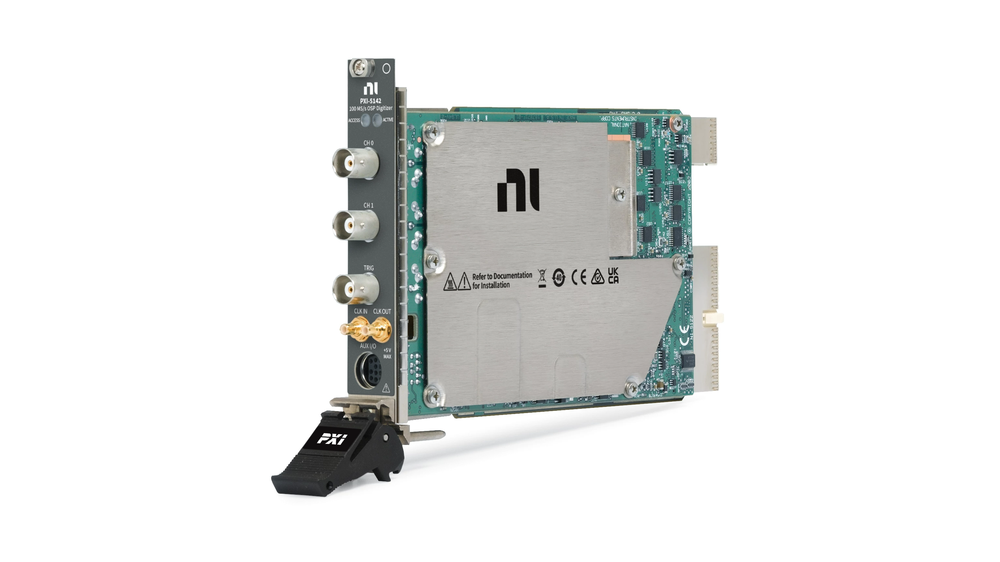

# PXI-5142

100 MHz, 100 MS/s, 14-Bit PXI Oscilloscope—The PXI-5142 high-resolution oscilloscope has two channels that are capable of high-resolution, low-noise measurements with up to 100 MHz of bandwidth and onboard resources for quadrature digital downconversion and baseband I/Q decimation. This device is ideal for communications measurements and applications that require interfacing with a RF downconverter. The PXI-5142 also features PXI synchronization and data streaming capabilities.

