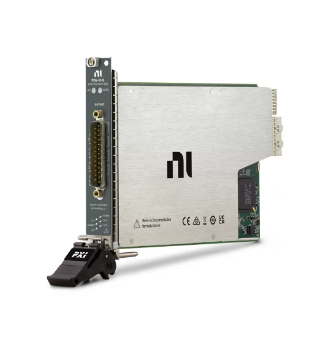

# PXIe-4141
The PXIe-4141 is a  4-Channel, ±10 V, 100 mA, Precision PXI Source Measure Unit (SMU)

## Getting started

The interface to the SMU can be opend by creating a PXIe4141 object.

*smu = PXIe4141(addr='PXI2Solt3', selftest=True, reset=True, log=True)*

Some main features are already supported with this library.
* Setting DC voltages and currents with current or voltage limit.
* Measure DC voltages and currents.
* Apply a sine wave to one channel.
* Logging to a logfile

## Logging
For an example of how the logging works see the test programm at the bottom of the file.

## TODO's
* Continous measurements for fast transient measurements

