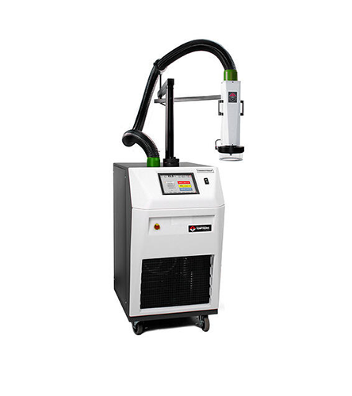

# TP04300A
The TP04300A is a Thermal Airstream System. Range -75º to +225ºC, Transition Rate (air) 10 sec, Acc. 1.0ºC, Res. +/- 0.1ºC Mobile Programmable Temperature System for high speed testing of components, parts,
hybrids, modules, subassemblies and printed circuit boards at precise temperature.

## General Information
| | |
| --- | --- |
| Device Category | Thermal Airstream System |
| Manufacturer | Temptronic |
| Device Typ | TP04300A |
| Location | RJ 2106 |
| Device Number | 04 |
| Inventory Number | None |
| Calibration Date | 6.8.2014 |
| Current Market Value (CHF) | 15000 |
| Public Device | &check; |
| Python | &check; |
| Matlab | &cross; |
| Labview | &check; |

## Getting started

The interface to the TP04300A can be opend by creating a TP04300A object.

*TP04300_obj = TP04300('Elefant', 'GPIB1::9::INSTR')

Some main features are already supported with this library.
* Head up/down 
* Flow on/off
* Set Teperature
* get Teperature

## TODO's
